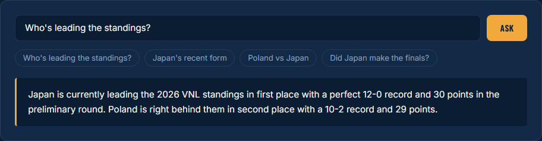

# VNL Volleyball Data Agent

A Django app that answers natural-language questions about the 2026 FIVB
Volleyball Men's Nations League — using a Gemini function-calling agent
grounded in real match data, not guesses.



**Ask it things like:**
- "What's Poland's record this season?"
- "Who's leading the standings?"
- "How has Japan played in their last 5 games?"
- "Did the higher seed win every time Poland and Japan met?"
- "Who's on Poland's roster?"

The agent picks the right data function per question, runs it against a
real SQLite database, and answers from the actual result — including
correctly declining to answer about teams that aren't in the tournament,
rather than making something up.

## Contents

- [Why this project](#why-this-project)
- [Setup](#setup-run-these-on-your-own-machine-in-this-project-folder)
- [Usage](#usage)
- [Architecture](#architecture)
- [Testing](#testing)
- [Data scope & known limitations](#data-scope--known-limitations)
- [Status](#status)

## Why this project

Most portfolio CRUD apps use data the developer already controls. This one
doesn't — it pulls from a real, occasionally unreliable external API,
which meant building actual judgment into the pipeline rather than just
displaying whatever came back:

- **The first data source lied about its own limits.** TheSportsDB's free
  tier silently capped results at ~15 matches/season for a competition
  that actually has ~116. This wasn't obvious until the numbers were
  cross-checked against Wikipedia's own tournament pages — the API
  returned *valid-looking*, just incomplete, data.
- **Switched to the Highlightly Volleyball API**, verified the men's vs.
  women's competition wasn't ambiguous (confirmed via roster composition:
  Iran, Cuba, and Argentina are men's-only VNL nations), and found *that*
  source was also incomplete for 2024/2025 — so the project is
  deliberately scoped to 2026 only, where the data is verified complete
  (116/116 matches, cross-checked against official results).
- **The agent layer had to survive a moving target.** Mid-build, the
  originally-planned Gemini model was retired, the recommended API calling
  pattern changed, and a real SDK bug (`google-genai` closing its HTTP
  client prematurely) had to be diagnosed against live GitHub issues, not
  assumptions. All three were fixed by checking current sources instead of
  guessing.
- **Free-tier quota is tight and inconsistent per model.** Rather than
  hard-coding one model and hoping, the agent tries a chain of free
  models in order, falling through to the next only on a real quota
  error — since Gemini's free-tier daily limits are tracked per model,
  this multiplies the usable daily budget at no cost.
- **Player-level stats were checked and confirmed unavailable.** Six
  sources were tested directly (not just read about) before concluding
  individual performance stats (kills, blocks, aces) aren't accessible
  anywhere on a free tier: TheSportsDB, Highlightly, SportsAPI Pro,
  Sportradar's own published data dictionary, FIVB's official stats page
  (server-rendered HTML, no API behind it, confirmed via live network
  inspection), and SportDevs (whose documented volleyball endpoint turned
  out to not even resolve). Player *rosters* (name, position, height,
  weight, age, nationality) were found and verified on SportsAPI Pro and
  are included — see `get_team_roster`.
- **Cross-provider name mismatches silently dropped a team.** Highlightly
  and SportsAPI Pro don't share IDs, so team matching happens by name --
  and SportsAPI Pro indexes Turkey under its local name ("Türkiye"), so a
  literal `"Turkey"` search returned zero results, not just a low-ranked
  one. Fixed with a small alias table that retries the search under the
  known local name when the first query comes up empty.

## Setup (run these on your own machine, in this project folder)

```bash
# 1. Install dependencies
pip install -r requirements.txt

# 2. Set up your API keys
cp .env.example .env
# then open .env and fill in HIGHLIGHTLY_API_KEY, GEMINI_API_KEY, and
# SPORTSAPIPRO_API_KEY

# 3. Pull VNL data into vnl.db (creates the database, 2026 season only)
python ingestion/fetch_vnl_data.py

# 4. Run Django's own migrations (auth, sessions -- separate from teams/matches)
python manage.py migrate

# 5. Start the dev server
python manage.py runserver
```

Then visit http://127.0.0.1:8000/

### Getting API keys (all free, no credit card)
- **Highlightly** (match data): https://highlightly.net/login
- **Gemini** (the agent): https://aistudio.google.com/apikey
- **SportsAPI Pro** (player rosters): https://sportsapipro.com — free tier
  is capped at 100 requests/day; ingestion uses one search + one roster
  call per team (up to 36/run), so it's easy to burn through the daily
  cap after a couple of re-runs and start seeing `429` errors

Keys are loaded automatically from `.env` via `python-dotenv` -- no need to
`export` them manually each session.

## Usage

**Web UI** (the intended way to use this): once the dev server is running,
visit http://127.0.0.1:8000/ for the standings table and the "Ask the
Agent" box shown in the screenshot above. Requests are CSRF-protected like
any other Django form POST.

**CLI**, for testing the agent directly without the web layer:

```bash
python agent/gemini_agent.py
```

Starts an interactive, multi-turn chat loop in the terminal (`quit` to
exit) using the same tools and system prompt as the web UI.

**As a library**, the four data functions are plain Python with no Django
dependency, so they can be called directly:

```python
from agent.queries import get_team_results
get_team_results("Poland")
```

## Architecture

```
vnl_agent/                    Django project settings, root URLconf.

tracker/                      Django app: dashboard view (standings) +
                               an ask-the-agent endpoint the frontend
                               calls via fetch(). Templates live in
                               tracker/templates/tracker/.

agent/queries.py              Five plain Python functions the agent can
                               call: get_team_results, get_head_to_head,
                               get_recent_form, get_standings,
                               get_team_roster. Independent of Django --
                               run/tested standalone (see Usage above).

agent/gemini_agent.py         Gemini function-calling agent. Passes the
                               query functions directly as tools (schema
                               is auto-generated from type hints +
                               docstrings). Falls back across multiple
                               free-tier models on quota errors.

ingestion/fetch_vnl_data.py   Pulls match + standings data from the
                               Highlightly Volleyball API into vnl.db
                               (SQLite, gitignored). Standings come
                               straight from the API's own table rather
                               than being recomputed locally, since VNL's
                               win-points system isn't a flat
                               1-point-per-win rule. Also pulls roster
                               data from a SECOND, unrelated provider
                               (SportsAPI Pro) -- each team's
                               cross-provider ID is resolved once via
                               name search and cached.
```

## Testing

```bash
python manage.py test
```

Covers the `ask_agent` endpoint: CSRF enforcement (using
`Client(enforce_csrf_checks=True)`, since Django's default test client
disables CSRF checks and would silently hide a regression there), input
validation, and error passthrough. The Gemini call itself is mocked, so
tests don't burn API quota.

## Data scope & known limitations

- Scoped to the **2026 men's VNL season only**. 2024/2025 were dropped
  after discovering incomplete match coverage on the free API tier
  (80/104 and 89/116 matches respectively) -- shipping known-incomplete
  data seemed worse than a smaller, verified-correct dataset.
- `get_team_results` includes finals-bracket matches; `get_standings`
  reflects only the 12-game preliminary round (matching the official VNL
  table). A team's record can legitimately look different between the
  two -- the agent is prompted to explain this when it's relevant to the
  question asked.
- Round/week labels aren't populated by the current data source.
- **No individual player performance statistics** (kills, blocks, aces,
  digs, points, serve/reception %). Checked directly against six sources
  -- TheSportsDB, Highlightly, SportsAPI Pro, Sportradar's own published
  statistics schema, FIVB's official stats page (confirmed via live
  browser network inspection to be server-rendered HTML with no API
  behind it), and SportDevs (documented endpoint, but the domain itself
  doesn't resolve) -- and confirmed unavailable on any free tier. Player
  rosters (name, position, height, weight, age, nationality) ARE
  available and included via `get_team_roster`.

## Status

- [x] Data pipeline (Highlightly API, 2026 season, verified complete)
- [x] Query functions, tested against real data
- [x] Gemini function-calling agent, tested multi-turn, with model fallback
- [x] Django views + templates (dashboard + ask endpoint)
- [x] `.env`-based API key handling
- [x] Player roster data (SportsAPI Pro), verified against real 2026 squad
- [x] Automated tests for the ask-agent endpoint (CSRF, validation, errors)
- [ ] Deployment
